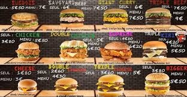

 

<h1 align="center">EDB</h1>

    
#### EDB© 2021 All Rights Reserved.  GPL3.0 All material must be cited or credited, when using material (free to use).  A burger logger application, using MySQL, Node, Express, Handlebars and a homemade ORM (yum!).

 

<h2 align="center">Table of Contents</h2>

* [Repository Description](#Repository-Description)
* [Deployment](#deployment)
* [Demostration and Build](#demo)
* [Installation](#installation)
* [Usage](#usage)
* [Testing](#testing)
* [Contributions and Guidelines](#contributions)
* [Resources](#resources)
* [Point of Contact](#point-of-contact)
* [License](#license)

 

<h2 align="center">Repository Description</h2>

###### [Back to Table of Contents](#Table-of-Contents)
EDB (Eat-Da-Burger!) is a restaurant app,  which allows users to input the names of burgers they would like to eat.)  Whenever a user submits a burger's name, this application will display the same burger on the left side of the page (waiting to be devoured 😋 ); then, each burger in this waiting area, will also have a `Devour it!` button: so each time a user clicks it, the burger will move to the right side of the page.  This application will store **every** burger in a database, whether devoured or not.

 

<h2 align="center">Deployment</h2>

###### [Back to Table of Contents](#Table-of-Contents)
[Deployed Application](TBD...) and source code can be viewed in this [GitHub Repository](https://github.com/supercodingninja/EDB)

 

<h2 align="center">Video Demostrations and Build</h2>

###### [Back to Table of Contents](#Table-of-Contents)
Video: Ideal Application Build 👇🏿 | Video: This Application Demonstration 👇🏿
:-------------------------:|:-------------------------:

    
    

       

<h2 align="center">Installation</h2>

###### [Back to Table of Contents](#Table-of-Contents)
1.  Ensure that your application includes the require dependacies, by typing the commnd in your integrated terminal "npm install inquirer".
2.  Create a .gitignore file and include node_modules/ and .DS_Store/ so that your node_modules directory isn't tracked or uploaded to GitHub.
3.  Run “node [fileName].js”
4.  Run "npm i."
5.  Run "npm start."
6.  Click on localHost, and view in browser.

 

<h2 align="center">Usage Information</h2>

###### [Back to Table of Contents](#Table-of-Contents)
This repository can be used for projects, non-profit organizations, academic clubs; and much more!  Not for commercial use, unless granted by the author.

 

<h2 align="center">Testing</h2>

###### [Back to Table of Contents](#Table-of-Contents)
TBD...

 

<h2 align="center">Contributions and Guidelines</h2>

###### [Back to Table of Contents](#Table-of-Contents)
I hope you enjoy this repository, and the application's link, given above and below (I love developing new projects).  Please feel free to fork and even collaborate with me on this awesome repository!  Thank you for viewing! - Frederick Thomas, [Super Coding Ninja™](https://github.com/supercodingninja)

 

<h2 align="center">References</h2>

###### [Back to Table of Contents](#Table-of-Contents)
1.  [NPMjs](https://www.npmjs.com/) provides Documentation, Installation, Examples, Methods, Objects, Questions, Answers, Separator, Prompt Types, User Interfaces and Layouts, Reactive Interface, Support, Known issues, News, Contributing, License, and Plugins.

2.  [Shields IO](https://shields.io/) provides documentations on how to add your shield, for creditbility.  Please feel free to view this resource, for your future developments.

3.  **[Eloquent JavaScript](https://eloquentjavascript.net/)**, 3rd edition (2018)
This is a book about JavaScript, programming, and digital wonders. Read it online here; or get your own paperback copy.  Written by Marijn Haverbeke.  Licensed under a Creative Commons attribution-noncommercial license. All code in this book may also be considered licensed under an MIT license.

4.  [Guide to Handlebars: Templating Engine for Node/JavaScript](https://stackabuse.com/guide-to-handlebars-templating-engine-for-node/) explains that express is a routing, and middleware is a web framework; which has minimal functionality of its own (express applications are series of middleware function calls).

5.  [Using Middleware and Express](https://expressjs.com/en/guide/using-middleware.html) **Guide to Handlebars: Templating Engine for Node/JavaScript**, by Janith Kasun helps you understand Template Engines, Handlebars; and how to use them!

6.  [Web Application Architecture](https://hackr.io/blog/web-application-architecture-definition-models-types-and-more) describes architecture, Models of Web Componets,Types of Web Application Architecture; and Web App Development Tips!

7.  [Markdown Syntax](https://www.markdownguide.org/basic-syntax/) provides documentations on how to add your shield, for creditbility.  Please feel free to view this resource, for your future developments.  

 

<h2 align="center">Point of Contact</h2>

###### [Back to Table of Contents](#Table-of-Contents)
I hope this repository helps you along your development.  Stay on task, Get Ahead, Change The World! - [Frederick Thomas](https://www.linkedin.com/in/discoverfrederickthomas/), Super Coding Ninja™

 

<h2 align="center">License</h2>

###### [Back to Table of Contents](#Table-of-Contents)

EDB. A burger logger application, using MySQL, Node, Express, Handlebars, and a homemade ORM (yum!).

Copyright (C) 2021  Frederick Thomas, Super Coding Ninja™  All Rights Reserved.

EDB: you can redistribute it and/or modify
it under the terms of the GNU General Public License as published by
the Free Software Foundation, either version 3 of the License, or
(at your option) any later version.

EDB is distributed in the hope that it will be useful,
but WITHOUT ANY WARRANTY; without even the implied warranty of
MERCHANTABILITY or FITNESS FOR A PARTICULAR PURPOSE.  See the
GNU General Public License for more details.

You should have received a copy of the GNU General Public License
along with EDB.  If not, see <https://www.gnu.org/licenses/>.